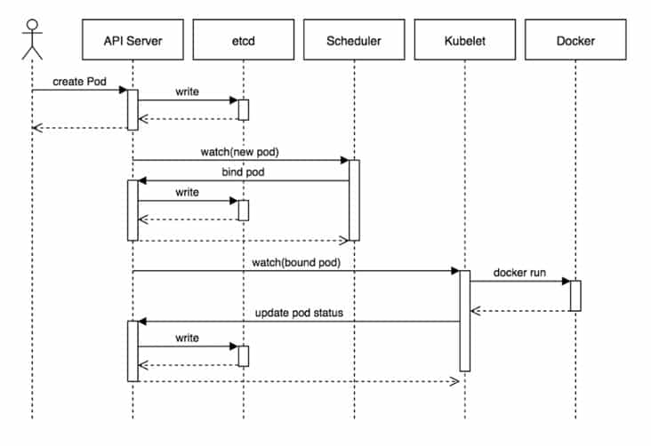

<!-- github-markdown-css -->
<link rel="stylesheet" href="https://cdnjs.cloudflare.com/ajax/libs/github-markdown-css/5.1.0/github-markdown-dark.css" />

    
쿠버네티스 개요, 아키텍쳐

    쿠버네티스는 컨테이너 오케스트레이션을 위한 오픈소스 플랫폼입니다. 컨테이너는 포함된 애플리케이션을 단계(개발, 프로덕션 등)와 환경(온프레미스, 퍼블릭 클라우드, 프라이빗 클라우드, 하이브리드 클라우드, 멀티클라우드) 간에 쉽게 이동하면서도 기능을 온전히 유지할 수 있도록 애플리케이션을 전체 실행(runtime) 환경과 함께 번들링하고 분리할 수 있게 해주는 기술입니다.
      
    컨테이너화된 애플리케이션을 실행하는 머신('노드'라고 하는 물리 또는 가상 서버)을 그룹화하여 클러스터를 생성한 다음, 이 클러스터를 쿠버네티스로 관리하고 오케스트레이션합니다.
      
    쿠버네티스 클러스터는 컨테이너화된 애플리케이션을 실행하는 노드라고 하는 워커 머신의 집합. 모든 클러스터는 최소 한 개의 워커 노드를 가진다.
      
    단일 머신 또는 노드에서 실행되고 리소스를 공유하는 컨테이너 그룹을 '포드'라고 하는데, 포드에 컨테이너가 한 개만 있을 수 있습니다. 이 경우 '포드'라는 말을 '컨테이너'로 바꿔도 여전히 개념은 정확하게 유지됩니다.

 

쿠버네티스 클러스터

 
<dl>
    <dt>
쿠버네티스 클러스터
</dt>
    <dd>쿠버네티스 클러스터는 컨트롤 플레인과 애플리케이션 플레인이라는 두 부분으로 되어 있습니다.</dd>
    <dd>컨트롤 플레인은 사용자가 클러스터와 상호 작용하고 커맨드 라인 툴인 kubectl을 사용해 커맨드 라인 내에서 클러스터가 할 작업을 지시하는 방식인 API가 있는 곳입니다. 최종 사용자, 클러스터 자체, 외부 구성 요소는 API를 통해 서로 통신할 수 있습니다.</dd>
    

    <dt>
컨트롤 플레인 컴포넌트
</dt>
        <dd class="subtitle">1. kube-apiserver</dd>
        <dd>쿠버네티스 클러스터와 상호 작용해야 하나요? API에 요청하세요. 쿠버네티스 API는 쿠버네티스 컨트롤 플레인의 프론트엔드로, 내부 및 외부 요청을 처리합니다.</dd>
        <dd>REST 호출이나 kubectl 커맨드라인 인터페이스 또는 kubeadm과 같은 기타 CLI(command-line interface)를 통해 API에 액세스할 수 있습니다.</dd>
          
        <dd class="subtitle">2. kube-scheduler</dd>
        <dd>노드가 배정되지 않은 새로 생성된 파드(POD)를 감지하고 실행할 노드를 선택하는 컨트롤 플레인 컴포넌트</dd>
        <dd>리소스 사양에 따라 대상 노드에 파드를 프로비저닝 한다</dd>
        <dd></dd>
          
        <dd class="subtitle">3. kube-controller-manager</dd>
        <dd>컨트롤러(API 서버를 통해 클러스터의 공유 상태를 감시하고, 필요한 경우에 생성 또는 변경을 요청하는 컨트롤 루프이다.</dd>
        <dd>각 컨트롤러는 현재 클러스터 상태를 의도한 상태에 가깝게 이동한다.</dd>
        <dd>논리적으로, 각 컨트롤러는 분리된 프로세스이지만, 복잡성을 낮추기 위해 모두 단일 바이너리로 컴파일되고 단일 프로세스 내에서 실행된다.</dd>
        <dd>
        <ul>
            <li>노드 컨트롤러 : 노드가 다운되었을 때 통지와 대응에 관한 책임을 가진다.</li>
            <li>레플리케이션(Replication) 컨트롤러 : 시스템의 모든 레플리케이션 컨트롤러 오브젝트에 대해 알맞은 수의 파드들을 유지시켜 주는 책임을 가진다.</li>
            <li>엔드포인트 컨트롤러: 엔드포인트 오브젝트를 채운다(즉, 서비스와 파드를 연결시킨다.)</li>
            <li>서비스 어카운트 & 토큰 컨트롤러: 새로운 네임스페이스에 대한 기본 계정과 API 접근 토큰을 생성한다.</li>
        </ul>
        </dd>
          
        <dd class="subtitle">4. cloud-controller-manager</dd>
        <dd>클러스터를 클라우드 공급자의 API에 연결하고, 해당 클라우드 플랫폼과 상호 작용하는 컴포넌트와 클러스터와만 상호 작용하는 컴포넌트를 구분할 수 있게 해 준다.</dd>
        <dd>cloud-controller-manager는 클라우드 제공자 전용 컨트롤러만 실행한다. 자신의 사내 또는 PC 내부의 학습 환경에서 쿠버네티스를 실행 중인 경우 클러스터에는 클라우드 컨트롤러 매니저가 없다.</dd>
        <dd>kube-controller-manager와 마찬가지로 논리적으로 독립적인 여러 컨트롤 루프를 단일 프로세스로 실행하는 단일 바이너리로 결합</dd>
        <dd>수평으로 확장(두 개 이상의 복제 실행)해서 성능을 향상시키거나 장애를 견딜 수 있다.</dd>
         
        <dd style="color:#ff6666">다음 컨트롤러들은 클라우드 제공 사업자의 의존성을 가질 수 있다.</dd>
        <dd>
        <ul>
            <li>노드 컨트롤러 : 노드가 응답을 멈춘 후 클라우드 상에서 삭제되었는지 판별하기 위해 클라우드 제공 사업자에게 확인하는 것</li>
            <li>라우트 컨트롤러 : 기본 클라우드 인프라에 경로를 구성하는 것</li>
            <li>서비스 컨트롤러 : 클라우드 제공 사업자 로드밸런서를 생성, 업데이트 그리고 삭제하는 것</li>
        </ul>
        </dd>
    

    <dt>
노드 컴포넌트
</dt>
    <dd class="subtitle">1. kubelet</dd>
    <dd>클러스터의 각 노드(쿠버네티스의 작업 장비(worker machine))에서 실행되는 에이전트.</dd>
    <dd>Kubelet은 파드(클러스터에서 실행 중인 컨테이너의 집합)에서 컨테이너가 확실하게 동작하도록 관리한다.</dd>
    <dd>Kubelet은, 쿠버네티스 컨트롤 플레인과 노드 간 통신을 책임지는 프로세스이며, 하나의 머신 상에서 동작하는 파드와 컨테이너를 관리한다.</dd>
      
    <dd class="subtitle">2. kube-proxy</dd>
    <dd>kube-proxy는 클러스터의 각 노드에서 실행되는 네트워크 프록시로, 쿠버네티스의 서비스(파드 집합에서 실행중인 애플리케이션을 네트워크 서비스로 노출) 개념의 구현부이다.</dd>
    <dd>kube-proxy는 노드의 네트워크 규칙을 유지 관리한다. 이 네트워크 규칙이 내부 네트워크 세션이나 클러스터 바깥에서 파드로 네트워크 통신을 할 수 있도록 해준다.</dd>
      
    <dd class="subtitle">3. 컨테이너 런타임</dd>
    <dd>컨테이너 실행을 담당하는 소프트웨어</dd>
    <dd>컨테이너 실행을 위해 각 컴퓨팅 노드에는 컨테이너 런타임 엔진이 있습니다. 그중 한 가지 예가 Docker입니다.</dd>
    <dd>쿠버네티스는 rkt, containerd, CRI-O와 같은 컨테이너 런타임 및 모든 Kubernetes CRI (컨테이너 런타임 인터페이스) 구현체를 지원</dd>
    <dd></dd>
</dl>

<!--
https://kubernetes.io/ko/docs/concepts/overview/components/
https://www.redhat.com/ko/topics/containers/kubernetes-architecture#%EA%B0%9C%EC%9A%94
-->

