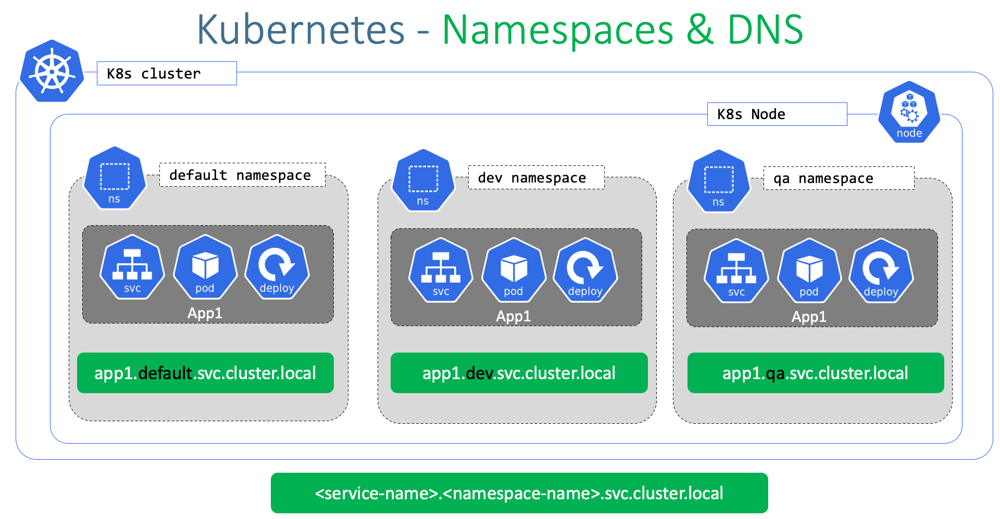

<!-- github-markdown-css -->
<link rel="stylesheet" href="https://cdnjs.cloudflare.com/ajax/libs/github-markdown-css/5.1.0/github-markdown-dark.css" />

    
네임스페이스

    <ul>
        <li>쿠버네티스에서, 네임스페이스 는 단일 클러스터 내에서의 리소스 그룹 격리 메커니즘을 제공</li>
        <li>리소스의 이름은 네임스페이스 내에서 유일해야 하며, 네임스페이스 간에서 유일할 필요는 없다.</li>
        <li>리소스 이름과 네임스페이스의 조합을 사용하여 각 리소스는 클러스터 전체에서 고유한 ID를 얻는다.</li>
        <li>네임스페이스 기반 스코핑은 네임스페이스 기반 오브젝트 (예: 디플로이먼트, 서비스 등) 에만 적용 가능하며 클러스터 범위의 오브젝트 (예: 스토리지클래스, 노드, 퍼시스턴트볼륨 등) 에는 적용 불가능하다.</li>
    </ul>

<dl>
    <dt>
네임스페이스 다루기
</dt>
    <dd>
네임스페이스 조회
</dd>
    <dd>사용 중인 클러스터의 현재 네임스페이스를 나열</dd>
    <dd>$ kubectl get namespaces</dd>
    <dd>
        <ul>
            쿠버네티스는 처음에 네 개의 초기 네임스페이스를 갖는다.
            <li>default
            기본적으로 Kubernetes 클러스터에서 생성된 모든 리소스는 default 네임스페이스에 생성된다.
            </li>
            <li>kube-system
            쿠버네티스 시스템에서 생성한 오브젝트를 위한 네임스페이스
            </li>
            <li>kube-public
            이 네임스페이스는 자동으로 생성되며 모든 사용자(인증되지 않은 사용자 포함)가 읽기 권한으로 접근할 수 있다. 
            이 네임스페이스는 주로 전체 클러스터 중에 공개적으로 드러나서 읽을 수 있는 리소스를 위해 예약되어 있다.
            </li>
            <li>kube-node-lease
            이 네임스페이스는 각 노드와 연관된 리스(Lease) 오브젝트를 갖는다. 
            리스(Lease)는 kubelet이 하트비트를 보내서 컨트롤 플레인이 노드의 장애를 탐지할 수 있게 한다.
            </li>
        </ul>
    </dd>
    

    <dt>
네임스페이스와 DNS
</dt>
    <dd>서비스(파드 집합에서 실행중인 애플리케이션을 네트워크 서비스로 노출하는 추상화 방법, 쿠버네티스는 파드에게 고유한 IP 주소와 파드 집합에 대한 단일 DNS 명을 부여하고, 그것들 간에 로드-밸런스를 수행할 수 있다.)를 생성하면 해당 DNS 엔트리가 생성된다.</dd>
    <dd>이 엔트리는 
<서비스-이름>.<네임스페이스-이름>.svc.cluster.local
의 형식을 갖는데, 이는 컨테이너가 <서비스-이름>만 사용하는 경우, 네임스페이스 내에 국한된 서비스로 연결된다. (개발, 스테이징, 운영과 같이 여러 네임스페이스 내에서 동일한 설정을 사용하는 경우에 유용)</dd>
    <dd>네임스페이스를 넘어서 접근하기 위해서는, 전체 주소 도메인 이름(FQDN : Fully Qualified Domain Name)을 사용해야 한다.</dd>
    <dd>그렇기 때문에, 모든 네임스페이스 이름은 유효한 RFC 1123 DNS 레이블이어야 한다.</dd>
    

    <dt>
모든 오브젝트가 네임스페이스에 속하지는 않음
</dt>
    <dd>대부분의 쿠버네티스 리소스(예를 들어, 파드, 서비스, 레플리케이션 컨트롤러 외)는 네임스페이스에 속한다.</dd>
    <dd>하지만 네임스페이스 리소스 자체는 네임스페이스에 속하지 않는다. 그리고 노드나 퍼시스턴트 볼륨과 같은 저수준 리소스는 어느 네임스페이스에도 속하지 않는다.</dd>
     
    <dd>
        # 네임스페이스에 속하는 리소스 
        kubectl api-resources --namespaced=true
         
        # 네임스페이스에 속하지 않는 리소스 
        kubectl api-resources --namespaced=false
    </dd>
</dl>

