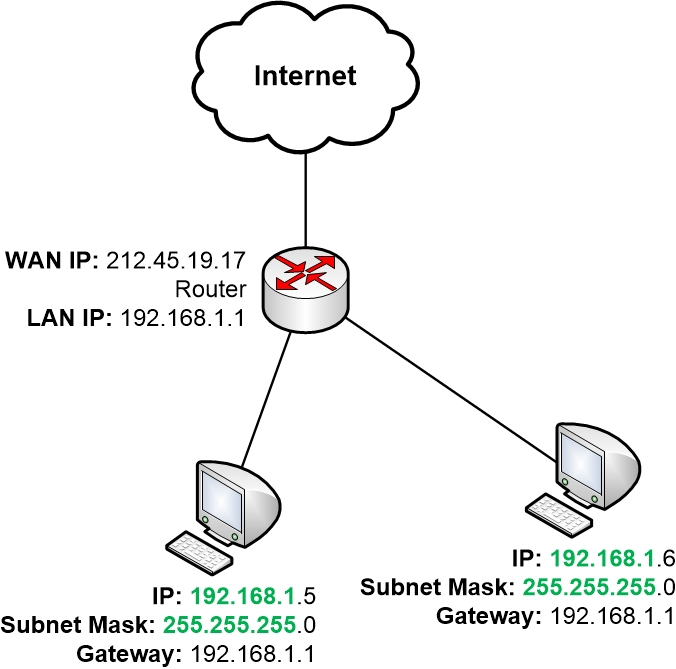
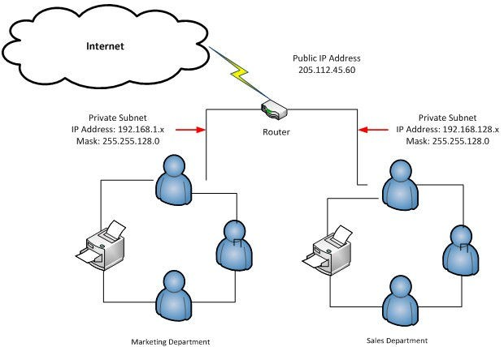
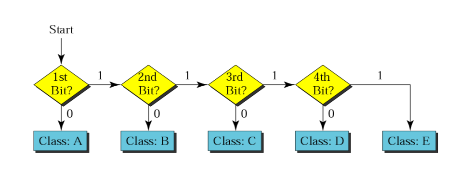
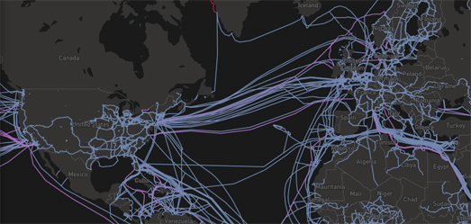

<!-- github-markdown-css -->
<link rel="stylesheet" href="https://cdnjs.cloudflare.com/ajax/libs/github-markdown-css/5.1.0/github-markdown-dark.css" />

    
공인IP 사설IP 개념

    사설IP 주소 지정의 개념은 IP주소 고갈 문제를 해결하기 위해 개발되었다. 
    사설IP 주소는 전 세계 모든 조직의 사설 네트워크에서 사용할 수 있으며 전 세계적으로 고유하지 않다. (동일한 로컬 네트워크 내의 사설IP는 고유해야 한다) 
    인터넷 라우터들은 사설IP 주소 범위에서 오는 모든 패킷을 패기하도록 구성되어있다(반드시 공인IP를 거쳐서 통신해야 함) 
    인터넷에 엑세스하기 위해 조직은 NAT(Network Address Translation)라는 기술을 사용할 수 있다. 

<dl>
    <dt>
NAT의 개념
</dt>
    <dd>모든 IPv4 IP 주소는 두 개의 주요 그룹으로 나눌 수 있습니다.</dd>
    <dd>
        <ul>
            <li>전역, 공개 또는 외부 - 이 그룹은 'WAN 주소'라고도 합니다. (인터넷에서 사용하는 주소)</li>
            <li>비공개, 로컬 또는 내부 주소 - 로컬 네트워크(LAN)에서 사용되는 주소</li>
        </ul>
    </dd>
    <dd>
        
        사설IP 주소를 사용하여 인터넷에 직접 엑세스 할 수 없다. 
        이 경우 인터넷 연결은 NAT를 통해 이루어진다 NAT는 사설 IP 주소를 공용 IP 주소로 변환 
        인터넷의 모든 서버와 사이트는 공개 IP 주소를 사용한다 (예: google.com — 172.217.22.14, Google의 DNS 서버 — 8.8.8.8).
        
    </dd>
      
    <dd>
        <table>
            <caption>예약된 사설 IPv4 네트워크 범위</caption>
            <thead>
                <tr>
                    <th>Network Class</th>
                    <th>CIDR block</th>
                    <th>Address range</th>
                    <th>Network Mask</th>
                    <th>Number of Networks</th>
                    <th>Number of Address</th>
                </tr>
            </thead>
            <tbody>
                <tr>
                    <td>CLASS A</td>
                    <td>10.0.0.0/8</td>
                    <td>10.0.0.0 ~ 10.255.255.255</td>
                    <td>255.0.0.0</td>
                    <td>1</td>
                    <td>16777216 (2의 24 제곱)</td>
                </tr>
                <tr>
                    <td>CLASS B</td>
                    <td>172.16.0.0/12</td>
                    <td>172.16.0.0 ~ 172.31.255.255</td>
                    <td>255.255.0.0</td>
                    <td>16</td>
                    <td>1048576 (2의 20 제곱)</td>
                </tr>
                <tr>
                    <td>CLASS C</td>
                    <td>192.168.0.0/16</td>
                    <td>192.168.0.0 ~ 192.168.255.255</td>
                    <td>255.255.255.0</td>
                    <td>256</td>
                    <td>65536 (2의 16 제곱)</td>
                </tr>
            </tbody>
        </table>
    </dd>
      
    <dd>
        NAT를 지원하는 IPv4 라우터는 홈 네트워크 장치들이 privider로 부터 받은 동일한 공인IP 주소를 사용할 수 있게
        NAT지원 IPv4 라우터를 사용하면 홈 네트워크 장치가 인터넷 연결을 위해 장치의 WAN-interface에서 시스템이 공급자(provider)로 부터 받은 동일한 공인IP 주소를 사용할 수 있다.
          
        인터넷에서도 홈 네트워크 컴퓨터에 접근하는 데 사용할 수 있는 공인IP 이지만 이를 위해서는 라우터에서 포트 포워딩을 설정해야 한다.
          
    </dd>
    <dd></dd>
    

    <dt>
서브넷 마스크 & 서브네팅(Subnetting)
</dt>
    <dd>
        IP 주소를 실제로 컴퓨터상에서 Netwrok Address와 Host Address로 구분하기 위해서 서브넷 마스크가 필요.
        즉, Netwrok Address 부분을 '1'로, Host Address 부분을 '0'으로 표기함으로써 서브넷 마스크가 구성되며, IP주소와 서브넷 마스크를 비트간에 AND 연산을 하면 네트워크 주소가 된다.
          
        예를 들어) IP주소가 210.100.100.1 이고 서브넷 마스크가 255.255.255.0 이면 Network Address는 210.100.100.0 이다.
        <pre class="subnet">
11010010.01100100.01100100.00000001 (210.100.100.1)   <- IP Address
11111111.11111111.11111111.00000000 (255.255.255.0)   <- Subnet Mask
------------------------------------------------------
11010010.01100100.01100100.00000000 (210.100.100.0)   <- AND연산 결과
        </pre>
        
            특정 서브넷 마스크가 있는 네트워크에서 허용되는 호스트의 수를 구하는 공식은 다음과 같다. 
            2^h - 2 (h는 서브넷 마스크에서 0의 수를 나타낸다)  
            서브넷 마스크가 바이너리로 변환된 경우 첫 번째 주소와 마지막 주소는 예약되어 있다.  
            첫 번째는 네트워크를 식별(Network IP : 호스트 부분이 모두 0인 IP 주소)하고 마지막은 브로드캐스트 주소(Broadcast IP : 호스트 부분이 모두 1인 IP주소)로 사용된다  
        
    </dd>
      
    <dd>
        
Subnetting

        
            서브넷을 사용하면 네트워크의 특정 클래스의 한 네트워크 내에서 다양한 하위 네트워크를 만들 수 있다. 
            서브넷 기술의 도움으로 특정 클래스(A, B, C)의 대규모 네트워크를 서로 다른 위치에 있는 각 노드 간의 상호 연결을 위해 더 작은 하위 네트워크로 분할할 수 있다. 
            네트워크의 각 노드는 고유한 IP와 서브넷 마스크IP를 가진다 
            N개의 네트워크를 연결하는 모든 스위치(switch), 라우터(router), 게이트웨이(gateway)는 N개의 고유한 네트워크 ID와 연결된 각 네트워크에 대해 하나의 서브넷 마스크를 가진다.
        
    </dd>
    <dd>
        <table>
            <caption>서브넷팅 주소 지정 체계</caption>
            <thead>
                <tr>
                    <th>IP Class</th>
                    <th>Subnet Mask(CIDR)</th>
                    <th>Subnet Mask(Decimal)</th>
                    <th>Subnet Mask(Binary)</th>
                    <th>Number of Subnets</th>
                    <th>No. of host per network</th>
                    <!-- <th>Network IP</th> -->
                    <!-- <th>Broadcast IP</th> -->
                </tr>
            </thead>
            <tbody>
                <tr>
                    <td>A</td>
                    <td>/8 (default)</td>
                    <td>255.0.0.0</td>
                    <td>11111111.00000000.00000000.00000000</td>
                    <td>0</td>
                    <td>2^24 - 2</td>
                </tr>
                <tr>
                    <td>A</td>
                    <td>/9</td>
                    <td>255.128.0.0</td>
                    <td>11111111.10000000.00000000.00000000</td>
                    <td>2</td>
                    <td>2^23 - 2</td>
                </tr>
                <tr>
                    <td>A</td>
                    <td>/10</td>
                    <td>255.192.0.0</td>
                    <td>11111111.11000000.00000000.00000000</td>
                    <td>4</td>
                    <td>2^22 - 2</td>
                </tr>
                <tr>
                    <td>B</td>
                    <td>/16 (default)</td>
                    <td>255.255.0.0</td>
                    <td>11111111.11111111.00000000.00000000</td>
                    <td>0</td>
                    <td>2^16 - 2</td>
                </tr>
                <tr>
                    <td>B</td>
                    <td>/17</td>
                    <td>255.255.128.0</td>
                    <td>11111111.11111111.10000000.00000000</td>
                    <td>2</td>
                    <td>2^15 - 2</td>
                </tr>
                <tr>
                    <td>B</td>
                    <td>/18</td>
                    <td>255.255.192.0</td>
                    <td>11111111.11111111.11000000.00000000</td>
                    <td>4</td>
                    <td>2^14 - 2</td>
                </tr>
                <tr>
                    <td>C</td>
                    <td>/24 (default)</td>
                    <td>255.255.255.0</td>
                    <td>11111111.11111111.11111111.00000000</td>
                    <td>0</td>
                    <td>2^8 - 2</td>
                </tr>
                <tr>
                    <td>C</td>
                    <td>/25</td>
                    <td>255.255.255.128</td>
                    <td>11111111.11111111.11111111.10000000</td>
                    <td>2</td>
                    <td>2^7 - 2</td>
                </tr>
                <tr>
                    <td>C</td>
                    <td>/26</td>
                    <td>255.255.255.192</td>
                    <td>11111111.11111111.11111111.11000000</td>
                    <td>4</td>
                    <td>2^6 - 2</td>
                </tr>
            </tbody>
        </table>
    </dd>
     
    <dd>
IP의 클래스 찾기
</dd>
    <dd></dd>
    

    <dt>
WAN
</dt>
    <dd>
        
            WAN은 광대역 통신망으로 정의되나 오늘날 네트워킹 기술에서는 먼 거리에 있는 서로 다른 LAN, MAN을 연결하는 네트워크를 의미 
            WAN은 ISP(Internet Service Provider)에 의해서 제공되어 조직의 LAN과 라우터 또는 유/무선 공유기에 의해 인터넷에 연결된다.
        
         
        실제로 전 세계가(국가와 국가 사이에) 광섬유로 된 해저 케이블로 연결되어 있다.
    </dd>
    <dd></dd>
</dl>

<!-- https://phaariz.files.wordpress.com/2010/06/5-slides-ip-addressing.pdf -->
