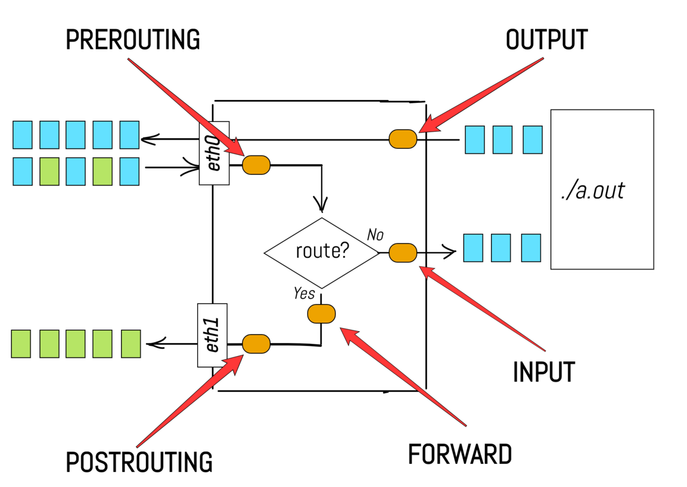
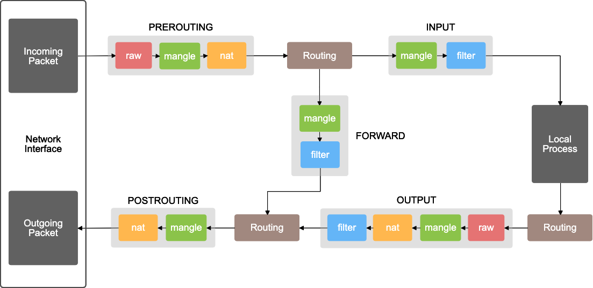
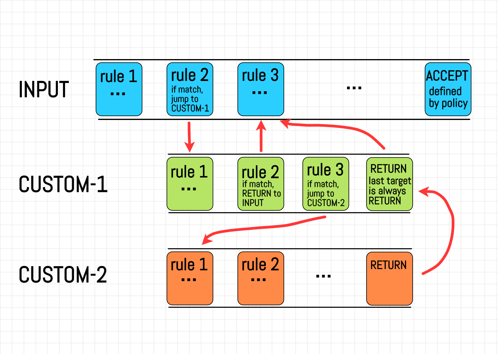

<!-- github-markdown-css -->
<link rel="stylesheet" href="https://cdnjs.cloudflare.com/ajax/libs/github-markdown-css/5.1.0/github-markdown-dark.css" />

    
IPTables

    iptables 방화벽은 패킷 필터링 및 NAT(DNAT + SNAT) 규칙을 관리하는 데 사용된다. 
    <h3 style="color:#ff0000">DNAT(Destination Network Address Translation)</h3>
    <h3 style="color:#ff0000">SNAT(Source Network Address Translation)</h3> 
    iptables는 모든 Linux 배포판과 함께 제공된다. 
    상위 수준의(high-level) iptables는 여러 테이블(tables)을 포함할 수 있다. 그리고 테이블에는 여러 체인(chains)이 포함될 수 있다. 
    체인들은 내장되거나 사용자가 정의할 수 있다. 
    체인은 들어오는 패킷과 나가는 패킷에 대한 규칙(rules)을 여러개 포함할 수 있다.
      
    따라서 구조는 IPTables -> Tables -> Chains -> Rules

<dl>
    

    <dt>
iptables(and ip6tables)의 구성파일
<dt>
    <dd>
        iptables 서비스는 /etc/sysconfig/iptables, /etc/sysconfig/ip6tables에 구성을 저장하고,  
        반면에 firewalld는 /usr/lib/firewalld/, /etc/firewalld/에 다양한 XML 파일에 구성을 저장한다.
          
        /etc/sysconfig/iptables 파일은 Red Hat Enterprise Linux에 기본적으로 firewalld가 설치되어 있으므로 존재하지 않습니다.
          
        iptables와 firewalld 둘 다 iptables 도구를 사용하여 커널 패킷 필터(Netfilter)와 통신한다. 
        firewalld 대신 iptables(또는 ip6tables) 서비스를 사용하려면 루트(root)로 다음 명령을 실행하여 firewalld를 비활성화한다.
         
<pre>
# systemctl disable firewalld
# systemctl stop firewalld
</pre>
    </dd>
    

    <dt>
Netfilter Hooks
</dt>
    <dd>Netfilter는 사용자 공간의 애플리케이션들이 패킷을 처리할 때 커널 네트워크 스택에 의해 적용되는 처리 규칙(Rules)을 등록할 수 있게 한다. (forwarding과 filtering이 가능하게 한다.)</dd>
    <dd>모든 패킷은 networking 시스템으로 들어오는데, 들어올 때 이러한 Hook(Netfilter)를 Trigger 하게 되고, 패킷들은 그 때 스택을 통해 통과된다.</dd>
    <dd>많은 일반적인 호스트 방화벽 애플리케이션과 Kubernetes 서비스 포워딩이 iptables로 구현된다.</dd>
      
    <dd>
        <table>
            <caption>Netfilter Hooks</caption>
            <thead>
                <tr>
                    <td>Hook</td>
                    <td>설명</td>
                </tr>
            </thead>
            <tbody>
                <tr>
                    <td>NF_IP_PRE_ROUTING</td>
                    <td>패킷이 네트워크 스택에 들어오고 난 바로 직 후, 초기 시점에 incoming 트래픽에 의해 트리거 될 것인데, 이 Hook은 이후 라우팅 결정 이전에 처리 된다.</td>
                </tr>
                <tr>
                    <td>NF_IP_LOCAL_IN</td>
                    <td>만약 패킷이 local system으로 목적지를 가지게 될 경우 incoming 패킷이 해당 목적지로 라우팅 되고 난 이후에 트리거 된다.</td>
                </tr>
                <tr>
                    <td>NF_IP_FORWARD</td>
                    <td>만약 패킷이 다른 host로 포워딩 될 경우, incoming 패킷이 해당 호스트로 라우팅 되고 난 이후 트리거 된다.</td>
                </tr>
                <tr>
                    <td>NF_IP_LOCAL_OUT</td>
                    <td>네트워크 스택을 만나자 마자, 로컬에 생성되어진 Outbound 트래픽에 의해 트리거 된다.</td>
                </tr>
                <tr>
                    <td>NF_IP_POST_ROUTING</td>
                    <td>라우팅이 발생하고 난 이후와 실제 네트워크에 놓여지기 바로 직전 어떤 outgoing이나 포워딩 된 트래픽에 의해 트리거 된다.</td>
                </tr>
            </tbody>
        </table>
    </dd>
    

    <dt>
Tables와 Chains
</dt>
    <dd>
        테이블은 사용자가 익숙한 형태에 따라 규칙(Rules)을 구분한다. 예들 들어 만약 하나의 규칙이 network 주소 변환을 다룬다면 그것은 nat 테이블로 놓여질 것이고, 규칙이 패킷을 목적지로 허용하는데 사용된다면 그것은 filter 테이블에 추가 될 것이다. 
        이러한 각각의 iptables 테이블 내에서 규칙들은 체인(chain)이라 불리는 그룹으로 묶여서 관리된다. 
        iptables에 내장된 대표적인 빌트인 체인(Built-in Chains)들은 앞서 소개한 netfilter hook과 1:1 대응 관계에 있다. 따라서, netfilter에서 특정 훅이 실행될 때, iptables에서 해당 훅에 대응되는 체인에 등록된 룰이 실행된다. 
    </dd>
      
    <dd>
        <ul>
            <li>
                PREROUTING : NF_IP_PRE_ROUTING Hook에 의해 트리거 된다. 
                (이 체인의 규칙(Rules)은 패킷이 네트워크 인터페이스에 막 도착할 때 패킷에 적용 -> 커널에서 라우팅 결정을 내리기 전에 취해야 할 액션을 정의)
            </li>
            <li>
                INPUT : NF_IP_LOCAL_IN Hook에 의해 트리거 된다. 
                (이 체인의 규칙(Rules)은 로컬 프로세스에 전달되기 직전에 패킷에 적용)
            </li>
            <li>
                FORWARD : NF_IP_FORWARD Hook에 의해 트리거 된다. 
                (현재 호스트를 통해 라우팅되는 모든 패킷에 적용)
            </li>
            <li>
                OUTPUT : NF_IP_LOCAL_OUT Hook에 의해 트리거 된다. 
                (이 체인의 규칙(Rules)은 로컬 프로세스에서 패킷이 생성된 직후 패킷에 적용)
            </li>
            <li>
                POSTROUTING : NF_IP_POST_ROUTING Hook에 의해 트리거 된다. 
                (이 체인의 규칙(Rules)은 패킷이 네트워크 인터페이스를 떠날 때 적용 -> 커널이 취한 라우팅 결정 후에 취해야 하는 액션을 정의)
            </li>
        </ul>
    </dd>
    <dd>
각 테이블에 구현된 체인
</dd>
    <dd>
        <table id="iptable-chain">
            <thead>
                <tr>
                    <td>Table / Chains</td>
                    <td>PREROUTING</td>
                    <td>INPUT</td>
                    <td>FORWARD</td>
                    <td>OUTPUT</td>
                    <td>POSTROUTING</td>
                </tr>
            </thead>
            <tbody>
                <tr>
                    <td>(routing decision)</td>
                    <td></td>
                    <td></td>
                    <td></td>
                    <td></td>
                    <td></td>
                </tr>
                <tr>
                    <td>raw</td>
                    <td></td>
                    <td></td>
                    <td></td>
                    <td></td>
                    <td></td>
                </tr>
                <tr>
                    <td>(connection tracking enabled)</td>
                    <td></td>
                    <td></td>
                    <td></td>
                    <td></td>
                    <td></td>
                </tr>
                <tr>
                    <td>mangle</td>
                    <td></td>
                    <td></td>
                    <td></td>
                    <td></td>
                    <td></td>
                </tr>
                <tr>
                    <td>nat (DNAT)</td>
                    <td></td>
                    <td></td>
                    <td></td>
                    <td></td>
                    <td></td>
                </tr>
                <tr>
                    <td>(routing decision)</td>
                    <td></td>
                    <td></td>
                    <td></td>
                    <td></td>
                    <td></td>
                </tr>
                <tr>
                    <td>filter</td>
                    <td></td>
                    <td></td>
                    <td></td>
                    <td></td>
                    <td></td>
                </tr>
                <tr>
                    <td>security</td>
                    <td></td>
                    <td></td>
                    <td></td>
                    <td></td>
                    <td></td>
                </tr>
                <tr>
                    <td>nat (SNAT)</td>
                    <td></td>
                    <td></td>
                    <td></td>
                    <td></td>
                    <td></td>
                </tr>
            </tbody>
        </table>
    </dd>
      
    <dd>
체인 순회 순서 - Chain Traversal Order
</dd>
    <dd>
        <ul class="ul-chain-traversal-order">
            <li>
                로컬 시스템으로 향하는 수신 패킷
                PREROUTING -> INPUT
            </li>
            <li>
                다른 호스트로 향하는 수신 패킷
                PREROUTING -> FORWARD -> POSTROUTING
            </li>
            <li>
                로컬에서 생성된 패킷
                OUTPUT -> POSTROUTING
            </li>
        </ul>
    </dd>
    <dd>
        

        위 표에서 로컬 시스템으로 향하는 수신 패킷이 먼저 raw, mangle, nat 테이블의 PREROUTING 체인에 대해 평가됨을 알 수 있다.

        

        그런 다음 최종적으로 로컬 소켓에 전달되기 전에 mangle, filter, security, nat 테이블의 INPUT 체인을 통과한다.
        

    </dd>
    <dd></dd>
    <dd></dd>
    

    <dt>
Rules
</dt>
    <dd>
        

            - 규칙(Rules)은 특정 테이블의 특정 체인 내에 배치된다. 
            - 각 체인이 호출되면 해당 패킷이 체인 내의 각 규칙에 대해 순서대로 확인됩니다. 
            - 각각의 규칙(Rules)은 프로토콜 유형, 목적지/출발지 주소, 목적지/출발지 포트, 목적지/출발지 네트워크, 입/출력 인터페이스, 헤더, 또는 다른 기준 중에서 연결 상태에 따라 일치하도록 규칙을 구성할 수 있다.
             
            - 이것들을 결합하여 서로 다른 트래픽을 구별하는 상당히 복잡한 규칙 세트를 생성할 수 있다.
        

    </dd>
    <!-- Matching / Targets -->
    <dd>
Matching
</dd>
    <dd>
        패킷이 충족해야 하는 "기준"이다.(Rule를 적용하기 위한 조건에 해당하는 부분) 
        특정 패킷이 현재 Rule에 부합한 경우, target에 등록된 구체적인 행동이 적용된다.
    </dd>
    <dd>
Targets
</dd>
    <dd>
        패킷이 Rule의 일치 기준(matching criteria)을 충족할 때 패킷을 어떻게 처리할지를 결정하는 실질적인 행위(action)에 해당하는 파트이다. 
        ===== 주요 Target 예 =====
        <ul class="Targets-li">
            <li>ACCEPT</li>
            <li>DROP</li>
            <li>REJECT</li>
            <li>LOG</li>
            <li>RETURN</li>
        </ul>
    </dd>
    

    <dt>
Custom Chains(사용자 정의 체인)
</dt>
    <dd>
        사용자가 직접 자체 체인을 만들 수도 있다. 
        규칙(Rules)들은 빌트인 체인과 마찬가지로 사용자 정의 체인에도 동일한 방법으로 배치할 수 있다. 
        차이점은 커스텀 체인은 규칙에서 "점프"하는 방식으로 도달할 수 있다. 
        커스텀 체인은 이를 호출한 체인의 단순한 확장 역할을 한다. 
        커스텀 체인 안에서 규칙 목록의 끝에 도달하거나, 규칙 목록 중에서 특정 rule에 매칭되어 return 대상이 활성화되면 평가(Evaluation)결과는 커스텀 체인을 호출한 체인으로 다시 전달된다. 
        평가는 커스텀 체인 안에서 다시 다른 커스텀 체인으로 이동할 수도 있다. 
    </dd>
    <dd>
        

            1. 실행할 체인의 규칙을 가리키는 포인터를 생각하면, 포인터의 체인 순회(Traversal)는 특정 Rule에 매칭되거나 FORWARD, INPUT과 같은 built-in 체인에 의해 끝날 때까지 규칙에서 규칙으로, 위에서 아래로 순회를 계속한다. 
            2. 동일한 테이블 내에서 다른 체인에 대한 점프 규칙을 지정할 수 있다. 
            3. built-in 체인과 다르게 커스텀 체인은 체인 끝에 기본정책(default policy)을 가질 수 없다. (일치하는 규칙이 없다면 기본 동작은 다시 원래 체인으로 점프하는 것이다)
        

    </dd>
    <dd></dd>
    

    <dt>
Connection Tracking(연결 추적)
</dt>
    <dd>
        Netfilter 프레임워크가 특정 연결 상태를 알 수 있도록 연결 추적이 수행된다. 이를 구현하는 방화벽을 상태 저장 방화벽(stateful firewall)이라고 한다.
        모든 연결 추적은 conntrack이라는 커널 내의 특수 프레임워크에 의해 수행된다.  
        
iptables에서 추적한 연결은 다음 상태중 하나이다.

        <ul style="font-size:16px;">
            <li>
                NEW : 
                기존 연결과 연결되지 않았지만 첫 번째 패킷으로 유효하지 않은 패킷이 도착하면, 새로운 커넥션이 "NEW" 레이블로 추가된다. 
                이것은 TCP와 같은 연결지향 프로토콜과 UDP와 같은 비연결(connectionless) 프로토콜 모두에서 발생한다.
            </li>
            <li>
                ESTABLISHED : 
                반대 방향에서 유효한 응답을 받으면 연결이 NEW에서 ESTABLISHED로 변경된다. 
                여기서 응답은 TCP 연결의 경우 SYN/ACK를 의미하고 UDP 및 ICMP 트래픽의 경우 원본 패킷의 source와 Destination이 전환되는 응답을 의미합니다.
            </li>
            <li>
                RELATED : 
                패킷이 기존 연결의 일부가 아니지만, 시스템에 이미 있는 연결과 관련된 패킷은 "RELATED" 레이블이 지정된다. (연결이 RELATED로 간주되려면 먼저 ESTABLISHED로 간주되는 연결이 있어야 한다.) 
                이것은 FTP 데이터 전송 연결의 경우처럼 도우미 연결을 의미하거나 또는 다른 프로토콜로 연결 시도에 대한 ICMP 응답일 수 있다.
            </li>
            <li>
                INVALID : 
                패킷이 기존 연결과 관련이 없고, 새 연결을 여는 데 적합하지 않거나, 식별할 수 없거나, 다른 이유로 라우팅할 수 없는 경우 패킷을 INVALID로 표시
            </li>
            <li>
                UNTRACKED : 
                패킷이 raw 테이블 내에서 target이 NOTRACK으로 표시되는 경우 해당 패킷은 UNTRACKED로 표시된다. 
                NOTRACK target은 이 규칙과 일치하는 모든 패킷에 대한 연결 추적을 끄는 데 사용된다.(패킷 추적을 우회하기 위해 사용한다.)
            </li>
            <li>
                SNAT : 
                NAT 작업에 의해 패킷의 source address가 변경되었을 때 설정된 가상상태. 
                이것은 응답 패킷이 도착했을 때 source address를 다시 원래대로 되돌려 놓기 위함
            </li>
            <li>
                DNAT : 
                NAT 작업에 의해 패킷의 destination address가 변경되었을 때 설정되는 가상상태. 
                이것은 응답 패킷이 도착했을 때 destination address를 다시 원래대로 되돌려 놓기 위함
            </li>
        </ul>
    </dd>
</dl>

<!--
https://www.tothenew.com/blog/basics-of-iptables/
https://velog.io/@koo8624/Linux-A-Deep-dive-into-iptables-and-Netfilter
https://netpple.github.io/2021/deep-dive-iptables-netfilter-architecture/
https://www.digitalocean.com/community/tutorials/a-deep-dive-into-iptables-and-netfilter-architecture
iptables 명령 튜토리얼
https://www.frozentux.net/iptables-tutorial/iptables-tutorial.html
-->
